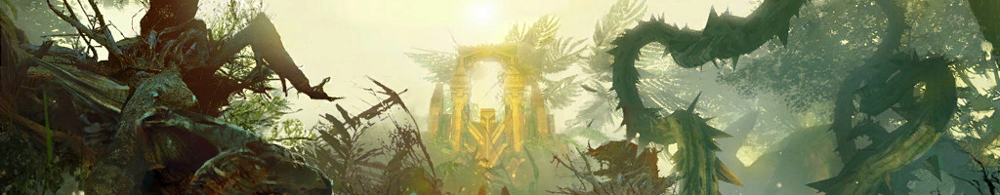

---
tags:
  - Heart of Thorns
  - Daily
---


# Auric Basin
---

??? info "Requirements"

    === "Must have"

        ``` markdown
        * Sed sagittis eleifend rutrum
        * Donec vitae suscipit est
        * Nulla tempor lobortis orci
        ```

    === "Nice to have"

        * Four commanders, one per outpost
        * Nuhoch Wallows mastery for quick transportation between outposts

## Battle in Tarir

| :material-play-circle-outline: Start | :material-clock-fast: Duration | :octicons-location-16: Waypoint |
| --- | --- | ---|
| Even hours at XX:00 | 20 minutes | `[&BN0HAAA=]`, `[&BGwIAAA=]`, `[&BAIIAAA=]`, `[&BAYIAAA=]` |

This last part of the meta event chain is commonly the only one being run. The squad should be split up roughly into four subgroups, with each assigned to one of four outposts commonly referred to as North  [Waypoint] , East [Waypoint] , West [Waypoint]  and South [Waypoint] . East can have fewer players, so if you only have one commander tag available, make sure they aren’t positioned at East since some players will likely stick to the tag despite being told otherwise.


* Squad setup
* Messages for commander to copy/paste

### Northwatch
here

```title="Commander message"
This is a message for the commander to copy/paste. Make sure it doesn't exceed the GW2 chat line character limit of 199.
```

### Eastwatch
here

### Southwatch
here

### Westwatch
here

<div>
  
  <span>
    <a href="https://wiki.guildwars2.com/wiki/Covered_in_Slime">Covered in Slime</a>
  </span>
</div>